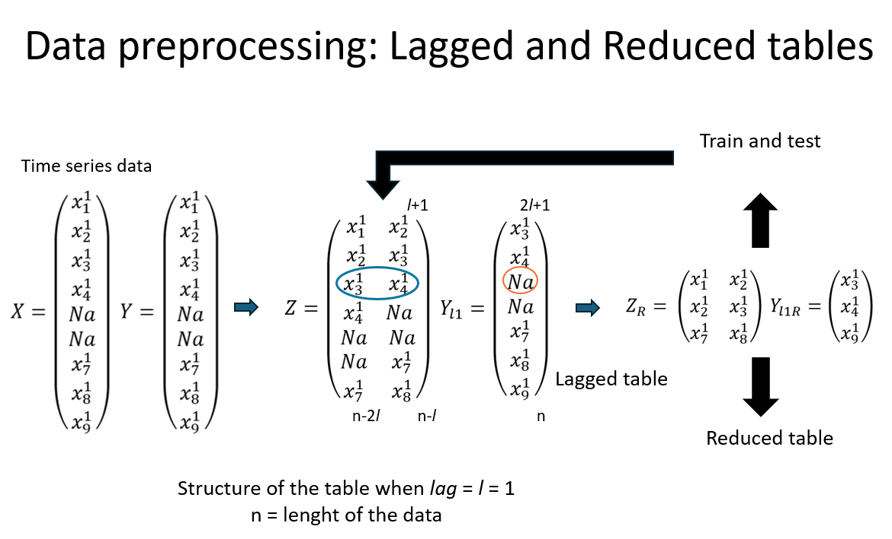
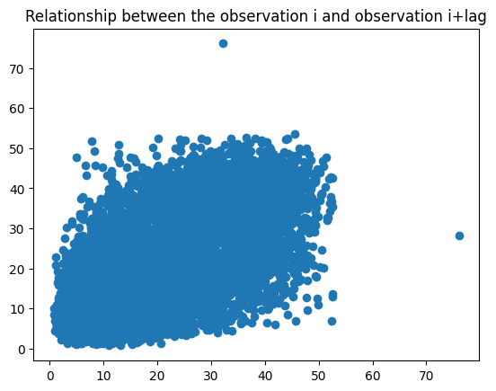
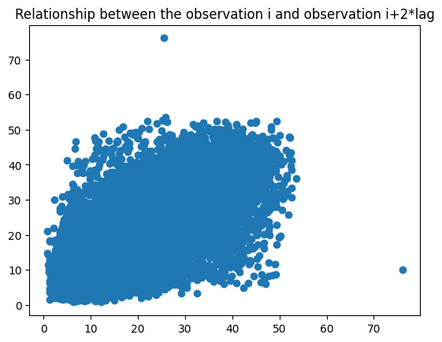

# Imputation model for multivariate time series using PyTorch

## Problem description:
The long periods with missing data among the series obstaculize the perfomance of deep time series analysis. At the same time de prediction task with an incomplete time series could became unreliable.
Algorithms and methods for analyzing time series data require a complete dataset. The reconstruction of time series with missing data has significantly improved with the advent of deep neural networks. Many researchers have utilized neural networks to fill in missing data, demonstrating superior results compared to traditional methods. Additionally, climatological data is a crucial source of information because it is intricately linked with various fields such as agriculture, tourism, transportation, natural disaster prevention, and water conservation. In recent years, deep learning methods have gained popularity for time series reconstruction.

- The data is for this project came from the repository of the [University of Wyoming](https://weather.uwyo.edu/upperair/sounding.html)
- The imputation process it is based on the [Part et al. (2022)](https://www.researchgate.net/publication/366552360_Long-term_missing_value_imputation_for_time_series_data_using_deep_neural_networks)
- The data has sporadic and long gaps with missing data.

### Import the libraries needed and connect to the Google Colab GPU

```python
#pip install -r requirements.txt
import torch
import os
import numpy as np
import pandas as pd
import matplotlib.pyplot as plt
import sklearn
!pip install -q install torchmetrics
import torchmetrics
from sklearn import metrics
from tqdm.notebook import tqdm, trange
device = 'cuda' if torch.cuda.is_available() else 'cpu'
!nvidia-smi
```
### Import the CSV

```python
file_name='DB_AP_L.csv'
folder_path = os.path.join(os.getcwd())
datos_AP = pd.read_csv(os.path.join(folder_path, file_name), sep=',')
datos_AP.index = datos_AP["Fecha"]
datos_AP = datos_AP.drop(columns=["Fecha"])
print(datos_AP.head())
print(datos_AP.tail())
```
<div>
<table border="1" class="dataframe">
  <thead>
    <tr style="text-align: right;">
      <th>Fecha</th>
      <th>CDMX</th>
      <th>Chihuahua</th>
      <th>Empalme</th>
      <th>Guadalajara</th>
      <th>Zacatecas</th>
      <th>Mazatlan</th>
      <th>Manzanillo</th>
      <th>Monterrey</th>
      <th>LaPaz</th>
      <th>Tucson</th>
      <th>Veracruz</th>
      <th>Merida</th>
    </tr>
  </thead>
  <tbody>
    <tr>
      <th>01/01/1980</th>
      <td>11.77</td>
      <td>6.05</td>
      <td>8.56</td>
      <td>10.02</td>
      <td>NaN</td>
      <td>14.05</td>
      <td>24.95</td>
      <td>11.57</td>
      <td>NaN</td>
      <td>5.15</td>
      <td>32.74</td>
      <td>17.24</td>
    </tr>
    <tr>
      <th>02/01/1980</th>
      <td>12.31</td>
      <td>5.10</td>
      <td>11.44</td>
      <td>14.22</td>
      <td>NaN</td>
      <td>20.20</td>
      <td>28.06</td>
      <td>6.38</td>
      <td>NaN</td>
      <td>8.87</td>
      <td>27.71</td>
      <td>16.26</td>
    </tr>
    <tr>
      <th>03/01/1980</th>
      <td>10.63</td>
      <td>8.14</td>
      <td>9.01</td>
      <td>11.70</td>
      <td>NaN</td>
      <td>19.99</td>
      <td>20.82</td>
      <td>22.50</td>
      <td>NaN</td>
      <td>5.10</td>
      <td>29.78</td>
      <td>19.04</td>
    </tr>
    <tr>
      <th>04/01/1980</th>
      <td>7.23</td>
      <td>5.46</td>
      <td>10.05</td>
      <td>NaN</td>
      <td>NaN</td>
      <td>22.77</td>
      <td>20.25</td>
      <td>8.44</td>
      <td>NaN</td>
      <td>5.64</td>
      <td>33.51</td>
      <td>31.82</td>
    </tr>
    <tr>
      <th>05/01/1980</th>
      <td>6.54</td>
      <td>5.39</td>
      <td>9.87</td>
      <td>4.33</td>
      <td>NaN</td>
      <td>17.72</td>
      <td>14.66</td>
      <td>9.61</td>
      <td>NaN</td>
      <td>4.66</td>
      <td>24.17</td>
      <td>13.16</td>
    </tr>
  </tbody>
</table>
</div>

<div>
<table border="1" class="dataframe">
  <thead>
    <tr style="text-align: right;">
      <th>Fecha</th>
      <th>CDMX</th>
      <th>Chihuahua</th>
      <th>Empalme</th>
      <th>Guadalajara</th>
      <th>Zacatecas</th>
      <th>Mazatlan</th>
      <th>Manzanillo</th>
      <th>Monterrey</th>
      <th>LaPaz</th>
      <th>Tucson</th>
      <th>Veracruz</th>
      <th>Merida</th>
    </tr>
  </thead>
  <tbody>
    <tr>
      <th>27/12/2023</th>
      <td>16.61</td>
      <td>NaN</td>
      <td>8.44</td>
      <td>9.77</td>
      <td>NaN</td>
      <td>22.19</td>
      <td>30.92</td>
      <td>NaN</td>
      <td>15.04</td>
      <td>6.20</td>
      <td>NaN</td>
      <td>46.68</td>
    </tr>
    <tr>
      <th>28/12/2023</th>
      <td>4.24</td>
      <td>NaN</td>
      <td>NaN</td>
      <td>8.40</td>
      <td>NaN</td>
      <td>17.78</td>
      <td>NaN</td>
      <td>NaN</td>
      <td>16.56</td>
      <td>8.69</td>
      <td>NaN</td>
      <td>49.14</td>
    </tr>
    <tr>
      <th>29/12/2023</th>
      <td>NaN</td>
      <td>NaN</td>
      <td>NaN</td>
      <td>9.22</td>
      <td>NaN</td>
      <td>18.44</td>
      <td>23.44</td>
      <td>NaN</td>
      <td>13.35</td>
      <td>5.63</td>
      <td>40.66</td>
      <td>34.41</td>
    </tr>
    <tr>
      <th>30/12/2023</th>
      <td>8.38</td>
      <td>NaN</td>
      <td>6.96</td>
      <td>NaN</td>
      <td>5.48</td>
      <td>15.48</td>
      <td>23.78</td>
      <td>NaN</td>
      <td>10.63</td>
      <td>5.87</td>
      <td>NaN</td>
      <td>31.42</td>
    </tr>
    <tr>
      <th>31/12/2023</th>
      <td>NaN</td>
      <td>NaN</td>
      <td>7.48</td>
      <td>10.44</td>
      <td>NaN</td>
      <td>17.35</td>
      <td>28.18</td>
      <td>NaN</td>
      <td>11.72</td>
      <td>7.15</td>
      <td>NaN</td>
      <td>21.50</td>
    </tr>
  </tbody>
</table>
</div>

### Data visualization
#### Exploring the features of the time series data

```python
# Plot the last 4 years
datos_AP['01/01/2020':'31/12/2023'].plot(subplots=True, figsize=(23,10))
# Plot the first 4 years
datos_AP['01/01/2020':'31/12/2023'].plot(subplots=True, figsize=(23,10))
```


- Echa time series echibits missing data at various instances. These gaps can occur sporadically, but there are also instances of extended periods of missing values.
- It would be worthwile to explore some features as the number of total missing data and the correlation between series.

```python
Mtx_Corr_AP = datos_AP.corr()
mask = np.triu(np.ones_like(Mtx_Corr_AP, dtype=bool))
sns.heatmap(Mtx_Corr_AP, annot=True, mask=mask, cmap="crest")
plt.show()
```


```python
for i in range(datos_AP.shape[1]):
  n_miss = datos_AP.iloc[:,i].isnull().sum()
  print(f'Missing data in {datos_AP.columns[i]}: {n_miss} | Percentage of missing: {n_miss*100/datos_AP.shape[0]:.2f} %')
```

```
Missing data in CDMX: 1459 | Percentage of missing: 9.08 %
Missing data in Chihuahua: 5824 | Percentage of missing: 36.24 %
Missing data in Empalme: 5903 | Percentage of missing: 36.73 %
Missing data in Guadalajara: 4170 | Percentage of missing: 25.95 %
Missing data in Zacatecas: 10002 | Percentage of missing: 62.24 %
Missing data in Mazatlan: 4587 | Percentage of missing: 28.54 %
Missing data in Manzanillo: 3564 | Percentage of missing: 22.18 %
Missing data in Monterrey: 6841 | Percentage of missing: 42.57 %
Missing data in LaPaz: 7901 | Percentage of missing: 49.16 %
Missing data in Tucson: 411 | Percentage of missing: 2.56 %
Missing data in Veracruz: 3101 | Percentage of missing: 19.30 %
Missing data in Merida: 4076 | Percentage of missing: 25.36 %
```
## Imputation of Empalme data

The Empalme time series has a high correlation with Tucson, which is almost complete. So these two were used to replicate the data pre-processing as in [Park et al. (2022)](https://www.researchgate.net/publication/366552360_Long-term_missing_value_imputation_for_time_series_data_using_deep_neural_networks). In order to adapt the methodology to this project the process remains as follows:

<ol>
  <li>Generate a reduced table for the auxiliar time series
    <ol>
      <li>Choose a lag</li>
      <li>Understand the phenomenon</li>
    </ol>
  <li>Prepare de Dataset and the DataLoader
    <ol>
      <li>Split the data into train and test</li>
    </ol>
  <li>Build the model
    <ol>
      <li>Arquitecture of the neural netowrk</li>
      <li>Optimizer</li>
      <li>Loss function</li>
    </ol>
  </li>
  <li>Train and test loop
    <ol>
      <li>Save the best model</li>
      <li>Plot the learning curves</li>
    </ol>
  <li>Impute the missing values
    <ol>
      <li>Table lagged</li>
      <li>Visualize the imputations</li>
    </ol>
</ol>



### Methodology overview

The methodology used is flexible. Which allows to use different imputation strategies. These strategies could change due to the characteristics of the available data. Leveraging auxiliary information typically yields better imputation results due to the additional information that it is provided to the model. Nevertheless, the auxiliar time series should be free of missing data to be effective. This is not very common in the practice. Here it is a detailed explanation of the steps involved:

- Analyze the auxiliary time series
- Fill the missing values of the auxiliary time series using only the information within the auxiliary series (X1, X2; as inputs)
- Fill the missing values of the main time series using the information within it and the auxiliary time series imputed (X1, X2, X1_t, X2_t; as inputs)

## Generate a reduced table

```python
dt_mraw = datos_AP['Empalme']
aux_mraw = datos_AP['Tucson']
dates_array = aux_mraw.index
aux_mraw.index = [i for i in range(1,len(aux_mraw)+1)]
lag=364
X, X1, Y = aux_mraw[:len(aux_mraw)-(2*lag)], aux_mraw[lag:len(aux_mraw)-lag], aux_mraw[(2*lag):len(aux_mraw)]
X.index, X1.index, Y.index = [i for i in range(1, len(X)+1)], [i for i in range(1, len(X1)+1)], [i for i in range(1, len(Y)+1)]
TR_Reducida = pd.DataFrame({'X':X,
                           'X1':X1,
                           'Y':Y})
TR_Reducida = TR_Reducida.dropna()
TR_Reducida.index = [i for i in range(1,len(TR_Reducida)+1)]
TR_Reducida.head()
```
<table border="1">
  <tr>
    <th>X</th>
    <th>X1</th>
    <th>Y</th>
  </tr>
  <tr>
    <td>5.15</td>
    <td>9.17</td>
    <td>7.21</td>
  </tr>
  <tr>
    <td>8.87</td>
    <td>9.09</td>
    <td>8.98</td>
  </tr>
  <tr>
    <td>5.10</td>
    <td>14.13</td>
    <td>14.96</td>
  </tr>
  <tr>
    <td>6.19</td>
    <td>11.28</td>
    <td>6.74</td>
  </tr>
  <tr>
    <td>7.29</td>
    <td>11.65</td>
    <td>6.13</td>
  </tr>
</table>

### It is a regression problem

As we will see, the lag should simply the relationship between the inputs (X, X1) and the output (Y). In this case, the choosen lag was 365; since the precipitable water phenomenon has high autocorrelation every 365 days. So the values each 365 instances are highly autocorrelated. So, the neural network has to model a multiple linear relation.

```python
plt.scatter(x=TR_Reducida['X'], y=TR_Reducida['Y'])
plt.scatter(x=TR_Reducida['X1'], y=TR_Reducida['Y'])
```



### Brief parentheses

In order to use the extensions of PyTorch and take advantage from all its capabilities, it is necessary to explain some details about how does the dataset was built and set de DataLoader.

DataSet:
- *init* inicializate the object
- *len* lenght of the data frame (in this case the time series)
- *get item* it's main function is to extract the outputs and inputs whitin the **DataLoader**

DataLoader:
- Through the *get item* the batches are extracted.
- The batches are processed by the neural network.
- DataLoader operates as a iterator, which will be transmiting the information to train and test the models.

#### ¿Why *batches*?
A bacth is a subset of the dataframe.

- As the model recibes a lower number of observations, it could train in an efficient way in hardware terms.
- Convergence is more stable.
- Each batch show a different perspective of the dataframe reducing the chances of *overfit* the model.
- So the DataLoader has the complete set of batches, which it use to calculate the gradients based in the loss and update the parameters.

```python
# Building the dataset
class Obj_DataSet(torch.utils.data.Dataset):
  def __init__(self, datafile):
    self. x, self. y = self.numpy_torch(datafile)
    self.samples = self.y.shape[0]

  def __getitem__(self, idx):
    return self.x[idx], self.y[idx]

  def __len__(self):
    return self.samples

  def numpy_torch(self, datafile):
    input_NN = datafile.drop(columns=["Y"])
    output_NN = datafile.drop(columns=["X","X1"])
    x = torch.from_numpy(np.array(input_NN)).float()
    y = torch.from_numpy(np.array(output_NN)).float()
    return x, y
```

```python
# Building the train DataLoader and the train DataSet
TR_Reducida_DataSet = Obj_DataSet(TR_Reducida)
# Split the dataset that we have built into train and test
insta_entrena = int(len(TR_Reducida)*0.85)
insta_prueba = len(TR_Reducida)- insta_entrena

set_entrenamiento = Obj_DataSet(TR_Reducida[:insta_entrena])
set_prueba = Obj_DataSet(TR_Reducida[insta_entrena:])
#set_entrenamiento, set_prueba = torch.utils.data.random_split(TR_Yucatan_DataSet,
#                                                              [insta_entrena, insta_prueba])
print(f'Train set dimension {len(set_entrenamiento)}\nTest set dimension {len(set_prueba)}')

# DataLoader
BATCH_SIZE = 270
entrena_iterator = torch.utils.data.DataLoader(set_entrenamiento,
                                               batch_size=BATCH_SIZE)
prueba_iterator = torch.utils.data.DataLoader(set_prueba,
                                         batch_size=BATCH_SIZE)
```

```python
# We could access to the DataSet elements using the __getitem__ function
# The next loop print the first to elements in the train loader and the test loader
for i in range(9):
  print(f'SetEntrenamiento[{i}]: {set_entrenamiento.__getitem__(i)}')
for i in range(9):
  print(f'SetPrueba[{i}]: {set_prueba.__getitem__(i)}')
```

```
SetEntrenamiento[0]: (tensor([5.1500, 9.1700]), tensor([7.2100]))
SetEntrenamiento[1]: (tensor([8.8700, 9.0900]), tensor([8.9800]))
SetEntrenamiento[2]: (tensor([ 5.1000, 14.1300]), tensor([14.9600]))
SetEntrenamiento[3]: (tensor([ 6.1900, 11.2800]), tensor([6.7400]))
SetEntrenamiento[4]: (tensor([ 7.2900, 11.6500]), tensor([6.1300]))
SetEntrenamiento[5]: (tensor([18.2000,  5.9800]), tensor([7.4000]))
SetEntrenamiento[6]: (tensor([21.2200,  6.5300]), tensor([7.4600]))
SetEntrenamiento[7]: (tensor([24.2600,  8.6400]), tensor([4.5000]))
SetEntrenamiento[8]: (tensor([20.0400,  4.5600]), tensor([11.4900]))
SetPrueba[0]: (tensor([12.4300, 15.7500]), tensor([8.4100]))
SetPrueba[1]: (tensor([13.2100, 10.2200]), tensor([12.7800]))
SetPrueba[2]: (tensor([17.4700, 13.8800]), tensor([7.7400]))
SetPrueba[3]: (tensor([16.4000, 15.3500]), tensor([8.0800]))
SetPrueba[4]: (tensor([15.0000, 13.6400]), tensor([20.0400]))
SetPrueba[5]: (tensor([10.7100, 16.0900]), tensor([10.3200]))
SetPrueba[6]: (tensor([9.2300, 8.7300]), tensor([7.2600]))
SetPrueba[7]: (tensor([10.8300, 18.7400]), tensor([20.5600]))
SetPrueba[8]: (tensor([ 8.9000, 17.1100]), tensor([12.6000]))
```

### Building the structure of the neural network with *nn.Module*

```python
class ModeloImputacion(torch.nn.Module):
  def __init__(self, input_dim, output_dim, hidden_dim):
    super().__init__() # Se llaman a las funciones de nn.Module

    self.input_lay = torch.nn.Linear(in_features=input_dim,
                               out_features=hidden_dim)
    self.input_lay2 = torch.nn.Linear(in_features=hidden_dim,
                                out_features=hidden_dim)
    self.input_lay3 = torch.nn.Linear(in_features=hidden_dim,
                                out_features=output_dim)
    self.relu = torch.nn.ReLU()

  def forward(self, x):
    return self.input_lay3(self.relu(self.input_lay2(self.relu(self.input_lay(x)))))
```

```python
torch.manual_seed(44)
ModImputa_V1 = ModeloImputacion(input_dim=2, hidden_dim=17, output_dim=1).to(device)
ModImputa_V1.state_dict()
```
```
OrderedDict([('input_lay.weight',
              tensor([[ 0.3105,  0.3262],
                      [ 0.4636, -0.5171],
                      [ 0.1810,  0.3249],
                      [-0.2995, -0.4084],
                      [ 0.6839,  0.5264],
                      [ 0.6576,  0.4012],
                      [ 0.4350, -0.6211],
                      [ 0.3148, -0.2328],
                      [ 0.0495,  0.2993],
                      [ 0.4213, -0.3133],
                      [ 0.5582,  0.2395],
                      [ 0.5586, -0.0737],
                      [-0.0300, -0.2063],
                      [-0.6411,  0.3495],
                      [ 0.3990, -0.0996],
                      [-0.5475,  0.4826],
                      [-0.0031, -0.1989]], device='cuda:0')),
             ('input_lay.bias',
              tensor([ 0.3493, -0.5842, -0.0267, -0.0108,  0.3382, -0.1493, -0.6661,  0.3812,
                       0.1717, -0.5811, -0.1015, -0.6662,  0.2955, -0.1439, -0.4762,  0.3143,
                      -0.4216], device='cuda:0')),
             ('input_lay2.weight',
              tensor([[ 0.1446,  0.1672, -0.2338, -0.1916,  0.1372, -0.1867,  0.0577,  0.1182,
                        0.0047, -0.1159,  0.0108,  0.0630,  0.1887,  0.2193,  0.0084,  0.0138,
                       -0.0910],
                      [-0.0431, -0.0596,  0.0731,  0.0388, -0.2016,  0.0893,  0.0574, -0.0151,
                       -0.2286,  0.2194, -0.2046,  0.0010, -0.2229,  0.0240,  0.0301,  0.2321,
                        0.2176],
                      [ 0.0860,  0.1799,  0.2366, -0.0768, -0.1310,  0.1548, -0.0915,  0.0204,
                        0.0057, -0.1910, -0.0252,  0.1010,  0.2094, -0.0908, -0.0697,  0.1761,
                       -0.1424],
                      [-0.1760,  0.2239,  0.1927, -0.1070, -0.0698, -0.0702,  0.2312, -0.1399,
                        0.0094,  0.1050,  0.0829,  0.1315, -0.2212, -0.1607,  0.1861, -0.2180,
                       -0.1249],
                      [ 0.2000,  0.0971,  0.0822, -0.2202,  0.1157,  0.1140,  0.0808, -0.0353,
                        0.1834, -0.0520,  0.1089, -0.1056, -0.2224,  0.1339,  0.0088, -0.0862,
                        0.0999],
                      [ 0.1681, -0.1271, -0.2136, -0.1642,  0.0207, -0.0693,  0.2208, -0.1898,
                        0.0709, -0.2161, -0.1986, -0.1717, -0.0253,  0.1529, -0.2019, -0.1069,
                       -0.1027],
                      [-0.1347,  0.1953,  0.0832, -0.0932, -0.2155,  0.0983,  0.0033,  0.0888,
                        0.1399,  0.1818, -0.1341, -0.0628,  0.1177,  0.1883,  0.0644,  0.0841,
                        0.1775],
                      [ 0.1568, -0.1554,  0.1679, -0.0743, -0.0271,  0.0218, -0.0464,  0.0915,
                        0.1716, -0.1813,  0.1412, -0.1689,  0.1310, -0.0340,  0.2205,  0.0994,
                       -0.0275],
                      [-0.0940,  0.0469,  0.1468, -0.1993, -0.0223,  0.1136, -0.0130, -0.0492,
                       -0.1587,  0.0579, -0.0275,  0.1192, -0.0191, -0.0865, -0.0471, -0.1152,
                       -0.0903],
                      [-0.0247,  0.0540,  0.0647,  0.0834,  0.0730, -0.2419, -0.0030,  0.0740,
                        0.2312, -0.0014, -0.1226, -0.0631,  0.0889, -0.0045, -0.0864, -0.0422,
                       -0.1773],
                      [-0.1369,  0.1613, -0.1578,  0.1519, -0.0753, -0.0540,  0.1237,  0.0051,
                       -0.1684,  0.0005, -0.1704, -0.1974,  0.0883, -0.0189, -0.1440,  0.1589,
                        0.1211],
                      [-0.0389, -0.2076, -0.2014,  0.2368,  0.1020,  0.1638, -0.0151,  0.0159,
                        0.2114, -0.0665, -0.1224,  0.2305,  0.2100, -0.0403,  0.1129, -0.0093,
                       -0.2217],
                      [ 0.2138, -0.0266,  0.1829,  0.1495,  0.0452, -0.2168,  0.0873,  0.1725,
                        0.0170,  0.0819,  0.0949, -0.1135,  0.1967,  0.0718,  0.0098, -0.1285,
                        0.0454],
                      [ 0.0769, -0.0535, -0.0330, -0.0468,  0.2337,  0.1701,  0.1051, -0.2129,
                        0.2137,  0.0761,  0.0335, -0.0171,  0.0721, -0.1182,  0.0605, -0.0015,
                       -0.1126],
                      [-0.0601,  0.0373,  0.0587,  0.0241, -0.2283,  0.0966,  0.1237,  0.0165,
                        0.2166,  0.1494,  0.1348, -0.0574,  0.1923,  0.1027,  0.0893,  0.1552,
                        0.0084],
                      [-0.0065,  0.0247,  0.2236,  0.0491, -0.2141, -0.1163,  0.1976, -0.1388,
                       -0.2339,  0.0772, -0.0649,  0.0021,  0.1070, -0.0643,  0.0863,  0.2102,
                        0.0188],
                      [ 0.2057,  0.2417,  0.0594,  0.1973, -0.1040, -0.0836, -0.1206,  0.0984,
                        0.2042,  0.0737, -0.1884,  0.0589, -0.1363,  0.1477, -0.1551, -0.2198,
                       -0.2132]], device='cuda:0')),
             ('input_lay2.bias',
              tensor([ 0.1524, -0.2149,  0.1745, -0.1244,  0.1581, -0.2071, -0.0768,  0.0940,
                      -0.0355, -0.2158,  0.1889, -0.1900,  0.0348,  0.1359, -0.0432, -0.2065,
                       0.0029], device='cuda:0')),
             ('input_lay3.weight',
              tensor([[ 0.1289, -0.1853, -0.1007, -0.1490, -0.0169, -0.0368, -0.0211,  0.1183,
                        0.0617, -0.0934, -0.0393, -0.1367,  0.1658,  0.1176,  0.0335, -0.0856,
                       -0.2129]], device='cuda:0')),
             ('input_lay3.bias', tensor([-0.0486], device='cuda:0'))])
```       
### Define the optimizer and the loss function
```python
optimizer = torch.optim.Adam(params=ModImputa_V1.parameters(), lr=0.001) # Optimizador: Stochastic Gradient Descent
loss_fn = torch.nn.MSELoss().to(device) # Mean Square Error
```
