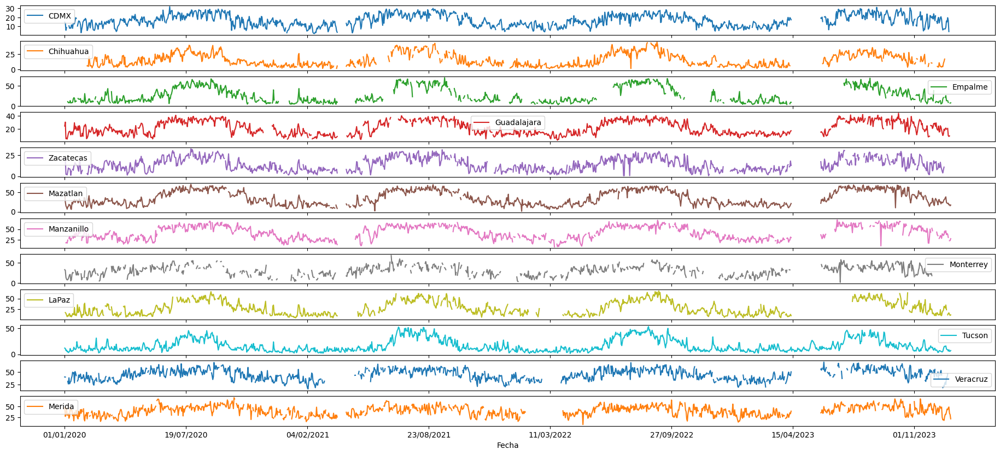
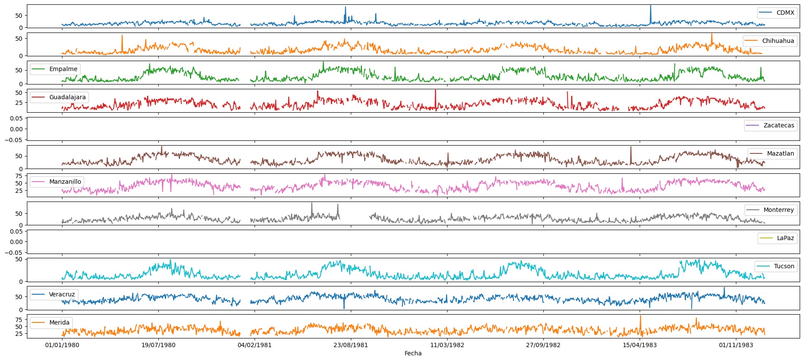
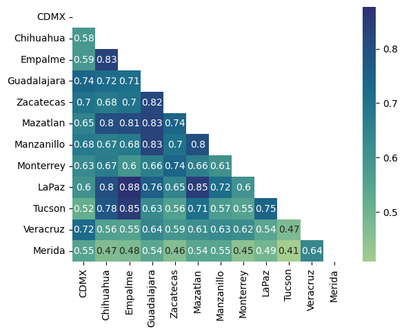

# Imputation model for multivariate time series using PyTorch

## Problem description:
The long periods with missing data among the series obstaculize the perfomance of deep time series analysis. At the same time de prediction task with an incomplete time series could became unreliable.
Algorithms and methods for analyzing time series data require a complete dataset. The reconstruction of time series with missing data has significantly improved with the advent of deep neural networks. Many researchers have utilized neural networks to fill in missing data, demonstrating superior results compared to traditional methods. Additionally, climatological data is a crucial source of information because it is intricately linked with various fields such as agriculture, tourism, transportation, natural disaster prevention, and water conservation. In recent years, deep learning methods have gained popularity for time series reconstruction.

- The data is for this project came from the repository of the [University of Wyoming](https://weather.uwyo.edu/upperair/sounding.html)
- The imputation process it is based on the [Part et al. (2022)](https://www.researchgate.net/publication/366552360_Long-term_missing_value_imputation_for_time_series_data_using_deep_neural_networks)
- The data has sporadic and long gaps with missing data.

### Import the libraries needed and connect to the Google Colab GPU

```python
#pip install -r requirements.txt
import torch
import os
import numpy as np
import pandas as pd
import matplotlib.pyplot as plt
import sklearn
!pip install -q install torchmetrics
import torchmetrics
from sklearn import metrics
from tqdm.notebook import tqdm, trange
device = 'cuda' if torch.cuda.is_available() else 'cpu'
!nvidia-smi
```
### Import the CSV

```python
file_name='DB_AP_L.csv'
folder_path = os.path.join(os.getcwd())
datos_AP = pd.read_csv(os.path.join(folder_path, file_name), sep=',')
datos_AP.index = datos_AP["Fecha"]
datos_AP = datos_AP.drop(columns=["Fecha"])
print(datos_AP.head())
print(datos_AP.tail())
```
<div>
<table border="1" class="dataframe">
  <thead>
    <tr style="text-align: right;">
      <th>Fecha</th>
      <th>CDMX</th>
      <th>Chihuahua</th>
      <th>Empalme</th>
      <th>Guadalajara</th>
      <th>Zacatecas</th>
      <th>Mazatlan</th>
      <th>Manzanillo</th>
      <th>Monterrey</th>
      <th>LaPaz</th>
      <th>Tucson</th>
      <th>Veracruz</th>
      <th>Merida</th>
    </tr>
  </thead>
  <tbody>
    <tr>
      <th>01/01/1980</th>
      <td>11.77</td>
      <td>6.05</td>
      <td>8.56</td>
      <td>10.02</td>
      <td>NaN</td>
      <td>14.05</td>
      <td>24.95</td>
      <td>11.57</td>
      <td>NaN</td>
      <td>5.15</td>
      <td>32.74</td>
      <td>17.24</td>
    </tr>
    <tr>
      <th>02/01/1980</th>
      <td>12.31</td>
      <td>5.10</td>
      <td>11.44</td>
      <td>14.22</td>
      <td>NaN</td>
      <td>20.20</td>
      <td>28.06</td>
      <td>6.38</td>
      <td>NaN</td>
      <td>8.87</td>
      <td>27.71</td>
      <td>16.26</td>
    </tr>
    <tr>
      <th>03/01/1980</th>
      <td>10.63</td>
      <td>8.14</td>
      <td>9.01</td>
      <td>11.70</td>
      <td>NaN</td>
      <td>19.99</td>
      <td>20.82</td>
      <td>22.50</td>
      <td>NaN</td>
      <td>5.10</td>
      <td>29.78</td>
      <td>19.04</td>
    </tr>
    <tr>
      <th>04/01/1980</th>
      <td>7.23</td>
      <td>5.46</td>
      <td>10.05</td>
      <td>NaN</td>
      <td>NaN</td>
      <td>22.77</td>
      <td>20.25</td>
      <td>8.44</td>
      <td>NaN</td>
      <td>5.64</td>
      <td>33.51</td>
      <td>31.82</td>
    </tr>
    <tr>
      <th>05/01/1980</th>
      <td>6.54</td>
      <td>5.39</td>
      <td>9.87</td>
      <td>4.33</td>
      <td>NaN</td>
      <td>17.72</td>
      <td>14.66</td>
      <td>9.61</td>
      <td>NaN</td>
      <td>4.66</td>
      <td>24.17</td>
      <td>13.16</td>
    </tr>
  </tbody>
</table>
</div>

<div>
<table border="1" class="dataframe">
  <thead>
    <tr style="text-align: right;">
      <th>Fecha</th>
      <th>CDMX</th>
      <th>Chihuahua</th>
      <th>Empalme</th>
      <th>Guadalajara</th>
      <th>Zacatecas</th>
      <th>Mazatlan</th>
      <th>Manzanillo</th>
      <th>Monterrey</th>
      <th>LaPaz</th>
      <th>Tucson</th>
      <th>Veracruz</th>
      <th>Merida</th>
    </tr>
  </thead>
  <tbody>
    <tr>
      <th>27/12/2023</th>
      <td>16.61</td>
      <td>NaN</td>
      <td>8.44</td>
      <td>9.77</td>
      <td>NaN</td>
      <td>22.19</td>
      <td>30.92</td>
      <td>NaN</td>
      <td>15.04</td>
      <td>6.20</td>
      <td>NaN</td>
      <td>46.68</td>
    </tr>
    <tr>
      <th>28/12/2023</th>
      <td>4.24</td>
      <td>NaN</td>
      <td>NaN</td>
      <td>8.40</td>
      <td>NaN</td>
      <td>17.78</td>
      <td>NaN</td>
      <td>NaN</td>
      <td>16.56</td>
      <td>8.69</td>
      <td>NaN</td>
      <td>49.14</td>
    </tr>
    <tr>
      <th>29/12/2023</th>
      <td>NaN</td>
      <td>NaN</td>
      <td>NaN</td>
      <td>9.22</td>
      <td>NaN</td>
      <td>18.44</td>
      <td>23.44</td>
      <td>NaN</td>
      <td>13.35</td>
      <td>5.63</td>
      <td>40.66</td>
      <td>34.41</td>
    </tr>
    <tr>
      <th>30/12/2023</th>
      <td>8.38</td>
      <td>NaN</td>
      <td>6.96</td>
      <td>NaN</td>
      <td>5.48</td>
      <td>15.48</td>
      <td>23.78</td>
      <td>NaN</td>
      <td>10.63</td>
      <td>5.87</td>
      <td>NaN</td>
      <td>31.42</td>
    </tr>
    <tr>
      <th>31/12/2023</th>
      <td>NaN</td>
      <td>NaN</td>
      <td>7.48</td>
      <td>10.44</td>
      <td>NaN</td>
      <td>17.35</td>
      <td>28.18</td>
      <td>NaN</td>
      <td>11.72</td>
      <td>7.15</td>
      <td>NaN</td>
      <td>21.50</td>
    </tr>
  </tbody>
</table>
</div>

### Data visualization
#### Exploring the features of the time series data

```python
# Plot the last 4 years
datos_AP['01/01/2020':'31/12/2023'].plot(subplots=True, figsize=(23,10))
# Plot the first 4 years
datos_AP['01/01/2020':'31/12/2023'].plot(subplots=True, figsize=(23,10))
```



- Echa time series echibits missing data at various instances. These gaps can occur sporadically, but there are also instances of extended periods of missing values.
- It would be worthwile to explore some features as the number of total missing data and the correlation between series.

```python
Mtx_Corr_AP = datos_AP.corr()
mask = np.triu(np.ones_like(Mtx_Corr_AP, dtype=bool))
sns.heatmap(Mtx_Corr_AP, annot=True, mask=mask, cmap="crest")
plt.show()
```


```python
for i in range(datos_AP.shape[1]):
  n_miss = datos_AP.iloc[:,i].isnull().sum()
  print(f'Missing data in {datos_AP.columns[i]}: {n_miss} | Percentage of missing: {n_miss*100/datos_AP.shape[0]:.2f} %')
```

```
Missing data in CDMX: 1459 | Percentage of missing: 9.08 %
Missing data in Chihuahua: 5824 | Percentage of missing: 36.24 %
Missing data in Empalme: 5903 | Percentage of missing: 36.73 %
Missing data in Guadalajara: 4170 | Percentage of missing: 25.95 %
Missing data in Zacatecas: 10002 | Percentage of missing: 62.24 %
Missing data in Mazatlan: 4587 | Percentage of missing: 28.54 %
Missing data in Manzanillo: 3564 | Percentage of missing: 22.18 %
Missing data in Monterrey: 6841 | Percentage of missing: 42.57 %
Missing data in LaPaz: 7901 | Percentage of missing: 49.16 %
Missing data in Tucson: 411 | Percentage of missing: 2.56 %
Missing data in Veracruz: 3101 | Percentage of missing: 19.30 %
Missing data in Merida: 4076 | Percentage of missing: 25.36 %
```
## Imputation of Empalme data

The Empalme time series has a high correlation with Tucson, which is almost complete. So these two were used to replicate the data pre-processing as in [Park et al. (2022)](https://www.researchgate.net/publication/366552360_Long-term_missing_value_imputation_for_time_series_data_using_deep_neural_networks). In order to adapt the methodology to this project the process remains as follows:

<ol>
  <li>Generate a reduced table for the auxiliar time series
    <ol>
      <li>Choose a lag</li>
      <li>Understand the phenomenon</li>
    </ol>
  <li>Prepare de Dataset and the DataLoader
    <ol>
      <li>Split the data into train and test</li>
    </ol>
  <li>Build the model
    <ol>
      <li>Arquitecture of the neural netowrk</li>
      <li>Optimizer</li>
      <li>Loss function</li>
    </ol>
  </li>
  <li>Fourth item</li>
</ol>

